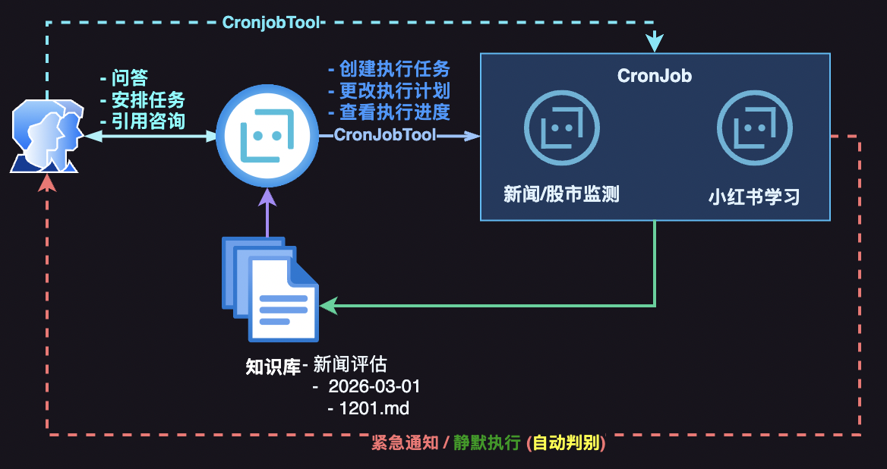

# 使用说明

本项目在[nanobot](https://github.com/HKUDS/nanobot)的基础上做了些定制化以满足一些日常需求如金融资讯监测、市场分析、小红书文章解读等。如果无用，请无视。如果有用也希望大家批判性地使用。千万不可轻信AI。



## 安装与配置
### 安装
* `conda create -n py311 python=3.11`
* `pip install git+https://github.com/wenmin-wu/finclaw.git`

### LLM
首推 [Kimi Code 套餐](https://www.kimi.com/code/console?from=membership)，包月套餐，可以多工具一起使用 e.g. Claude Code。 本项目将其作为默认模型。点击 [Kimi Code](https://www.kimi.com/code/console?from=membership) 进入控制台，新建`API Key`<your-kimi-api-key>`.

执行 `nanobot onboard` 将Agent模型更新为kimi
```
"defaults": {
  "workspace": "~/.nanobot/workspace",
  "model": "moonshot/kimi-for-coding",
  "provider": "auto",
  "maxTokens": 8192,
  "temperature": 0.1,
  "maxToolIterations": 40,
  "memoryWindow": 100,
  "reasoningEffort": null
}

# 配置kimi api key & api base
"moonshot": {
  "apiKey": "<your-kimi-api-key>",
  "apiBase": "https://api.kimi.com/coding/v1",
  "extraHeaders": null
},
```

### 聊天频道
* [飞书](./频道配置/飞书.md)
* [QQ](./频道配置/QQ.md)

## 新增工具

### Google Search AI 多轮对话（google_ai_chat）
与 Google Search AI 多轮对话，纯 Playwright 实现，无需 Chrome 插件或独立服务。配置 `tools.googleAiChat.enabled: true` 后，Agent 可调用 `google_ai_chat` 发送消息并获取回复。详见 [Google AI Chat (Playwright)](./updates/google-ai-chat-playwright.md)。

### 百度文心助手多轮对话（baidu_ai_chat）
与百度文心助手（chat.baidu.com/search）多轮对话，结构由 agent-browser 探测确定，专用 tab + Enter 发送、从 `p.marklang-paragraph` 取回复。需先启动 Chrome 调试（如 `scripts/start-chrome-debug.sh`，端口 9222），配置 `tools.baiduAiChat.enabled: true` 且 `useCdp: true`、`cdpPort: 9222`。详见 [百度文心多轮对话](./updates/baidu-ai-chat.md)。

### ReadRedNote
读取小红书文章

